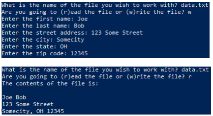

# Personal Information File

### Instructions:
 
- Create a Python program that does the following:
  - Prompts the user for the name of a file 
  - Asks the user if the file should be read from or written to 
   - If the user indicates that the file should be read it should:
     - Attempt to open the file named by the user, then retrieve and print in an attractive format the stored first name, last name, street address, city, state and zip code
     - This should be in its own function!!!
     - Use exception handling to print a user-friendly error message then exit the program if the data or file cannot be read
  - If the user indicates that the file should be written the program should:
    - prompt the user for a first name, last name, street address, city, state and zip code then write that information to the file named by the user
    - Use exception handling to print a user-friendly error message then exit the program if the data file cannot be created
    - This should be in its own function!!!
- Enter your name, the lab number, and the current date into a set of comments at the top of the code.          
- Push the program source code to the assignment repo. 

### Example Output

### Grading:
- General, compiles, comments, proper indentation, etc  
- Input/Output Processing
- Use of exception handling
- File Read  
- File Write
- Use of a function for reading the file
- Use of a function for writing the file
- Output formatted as in the example
